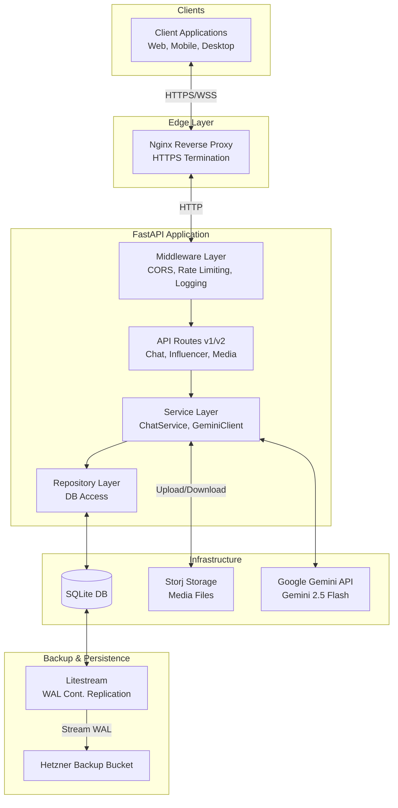

# System Architecture

## Overview

Yral AI Chat is a FastAPI-based REST API that enables multimodal conversations with AI influencer personas powered by Google Gemini.

## Architecture Diagram



## Core Components

### 1. API Layer (`src/api/v1/`)

**Responsibilities:**

- HTTP request/response handling
- Request validation
- Route definition
- OpenAPI documentation

**Key Files:**

- `chat.py` - Conversation and message endpoints
- `influencers.py` - AI influencer discovery
- `media.py` - File upload handling
- `health.py` - Health checks and monitoring

### 2. Service Layer (`src/services/`)

**Responsibilities:**

- Business logic
- External service integration
- Data transformation
- Error handling

**Components:**

- **ChatService**: Manages conversations and message flow
- **InfluencerService**: Handles influencer data and caching
- **GeminiClient**: Google Gemini AI integration with circuit breaker
- **StorageService**: S3 file upload/management

### 3. Repository Layer (`src/db/repositories/`)

**Responsibilities:**

- Database operations
- Query execution
- Data access abstraction

**Components:**

- **ConversationRepository**: CRUD for conversations
- **MessageRepository**: Message storage and retrieval
- **InfluencerRepository**: Influencer data access

### 4. Middleware (`src/middleware/`)

**Components:**

- **RateLimitMiddleware**: Token bucket rate limiting
- **RequestLoggingMiddleware**: Request/response logging with correlation IDs
- **APIVersionMiddleware**: API version header injection

### 5. Core Utilities (`src/core/`)

**Components:**

- **LRUCache**: Bounded in-memory cache with TTL
- **CircuitBreaker**: Fault tolerance for external services
- **Dependencies**: Dependency injection
- **Exceptions**: Custom exception hierarchy

## Data Flow

### Message Flow

```
1. Client sends message → 2. API validates request → 3. ChatService processes
                                                              │
4. Response to client ← 5. Repository saves ← 6. Gemini generates response
```

### Detailed Flow

1. **Client Request**
   - HTTP POST to `/api/v1/chat/conversations/{id}/messages`
   - JWT authentication
   - Rate limiting check

2. **Service Processing**
   - Retrieve conversation context
   - Build AI prompt with persona
   - Call Gemini API (with circuit breaker)

3. **Data Persistence**
   - Save user message
   - Save AI response
   - Update conversation timestamp

4. **Background Tasks**
   - Log AI token usage
   - Invalidate caches

## External Services

### Google Gemini API

- **Purpose**: AI response generation
- **Model**: gemini-2.5-flash
- **Features**: Multimodal support (text, images, audio)
- **Protection**: Circuit breaker pattern

### Storj S3-Compatible Storage

- **Purpose**: Media file storage (Images, audio)
- **Features**: Decentralized, secure S3-compatible storage
- **Protection**: Circuit breaker pattern
- **Public access**: Direct URL serving

### Litestream (Hetzner)

- **Purpose**: SQLite continuous backup
- **Target**: Hetzner S3-compatible storage
- **Features**: Real-time replication, point-in-time recovery

## Security

### Authentication

- JWT-based authentication
- Bearer token in Authorization header
- Token validation on protected endpoints

### Rate Limiting

- Token bucket algorithm
- Per-minute: 60 requests
- Per-hour: 1000 requests
- User and IP-based limiting

### Data Validation

- Pydantic v2 models
- Request/response validation
- Field-level constraints

### CORS

- Configurable allowed origins
- Credential support
- Wildcard methods/headers in dev

## Performance Optimizations

### Caching

- **LRU Cache**: Bounded in-memory cache (max 1000 items)
- **TTL**: 5-minute default, configurable per key
- **Cached Data**: Influencer lists, user metadata

### Database

- **Connection Pooling**: 1-20 concurrent connections
- **Async I/O**: Non-blocking database operations
- **Indexes**: Optimized for common queries

### Circuit Breakers

- **Gemini API**: Protects against AI service failures
- **S3 Storage**: Graceful degradation for uploads
- **States**: Closed, Open, Half-Open
- **Auto-recovery**: Exponential backoff

## Monitoring & Observability

### Logging (Loguru)

- Structured JSON logging in production
- Correlation IDs for request tracing
- Log levels: DEBUG, INFO, WARNING, ERROR
- Request/response duration tracking

### Health Checks

- Database connectivity
- AI service status
- Storage service status
- Circuit breaker states

## Scalability Considerations

### Horizontal Scaling

- Stateless application design
- Shared SQLite database (read replicas possible)
- Distributed cache considerations

### Vertical Scaling

- Connection pool sizing
- Worker process count
- Memory limits for cache

### Database Scaling

- SQLite suitable for moderate load
- Litestream provides backup/recovery
- Consider PostgreSQL for high concurrency

## Technology Stack

- **Framework**: FastAPI 0.104.1
- **Language**: Python 3.12
- **Database**: SQLite with aiosqlite
- **AI**: Google Gemini 2.5 Flash
- **Storage**: S3-compatible (Hetzner)
- **Backup**: Litestream
- **Validation**: Pydantic v2
- **Server**: Uvicorn
- **Logging**: Loguru

## Future Enhancements

- [x] WebSocket support for real-time messaging
- [ ] Redis for distributed caching
- [ ] Message queueing for background tasks
- [ ] Multi-region deployment
- [ ] Advanced analytics dashboard
- [ ] Voice synthesis for AI responses
