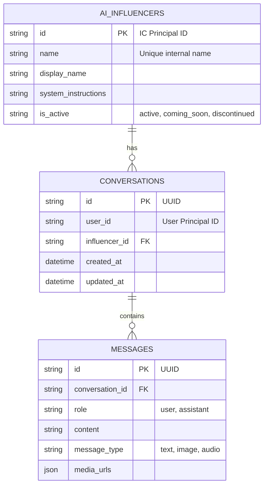

# 3. Database Schema

## Overview

The application uses **SQLite** as its primary database, chosen for its simplicity and compatibility with Litestream for replication.

* **File Location**: `/data/yral_ai_chat.db` (in production)
* **Library**: `aiosqlite` for async access.
* **Migrations**: Raw SQL files in `migrations/sqlite/`.

## ER Diagram

## Tables

### 1. `ai_influencers`

Stores the AI personas.

* **id**: String (IC Principal ID format).
* **system_instructions**: The core prompt defining the personality.
* **is_active**: Status enum controlling visibility.
* **suggested_messages**: JSON array of conversation starters.

### 2. `conversations`

Maps a user to an influencer.

* **Constraint**: Unique constraint on `(user_id, influencer_id)`.
* **metadata**: JSON field for extensible storage (e.g., extracted memories).

### 3. `messages`

The chat history.

* **message_type**: Supports `text`, `multimodal`, `image`, `audio`.
* **media_urls**: JSON array storing S3 keys for media.
* **client_message_id**: Used for idempotency to prevent duplicate messages.

## Data Access Layer

* **Repositories**: Located in `src/db/repositories/`.
* **Pattern**: Raw SQL queries using `aiosqlite`.
* **Connections**: Managed via a connection pool in `src/db/base.py`.

## Migrations

Migrations are raw SQL files in the `migrations/sqlite/` directory.

* **Execution**: Validated and run on application startup.
* **Versioning**: File prefix (e.g., `001_`, `002_`) determines order.
