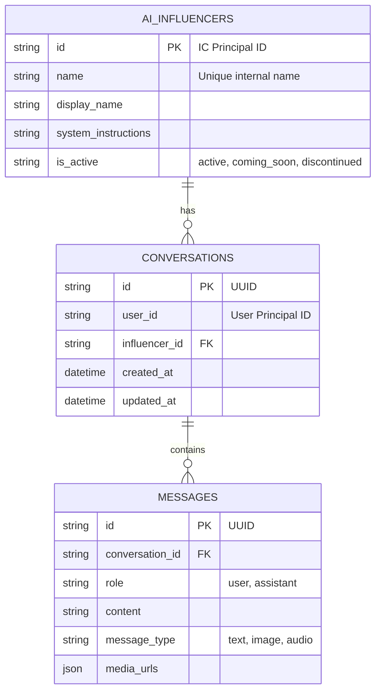

# 3. Database Schema

## Overview

The application uses **SQLite** as its primary database, chosen for its simplicity and efficiency. To ensure data durability, we use **Litestream** for real-time replication to **Hetzner S3**.

- **File Location**: `/data/yral_ai_chat.db` (in production)
- **Library**: `aiosqlite` for async access.
- **Backup**: Continuous WAL replication to **Hetzner S3** via Litestream.

## ER Diagram

## Tables

### 1. `ai_influencers`

Stores the AI personas.

- **id**: String (IC Principal ID format).
- **system_instructions**: The core prompt defining the personality.
- **is_active**: Status enum controlling visibility.
- **suggested_messages**: JSON array of conversation starters.

### 2. `conversations`

Maps a user to an influencer.

- **Constraint**: Unique constraint on `(user_id, influencer_id)`.
- **metadata**: JSON field for extensible storage (e.g., extracted memories).

### 3. `messages`

The chat history.

- **message_type**: Supports `text`, `multimodal`, `image`, `audio`.
- **media_urls**: JSON array storing S3 keys (hosted on **Storj**).
- **client_message_id**: Used for idempotency to prevent duplicate messages.

## Data Access Layer

- **Repositories**: Located in `src/db/repositories/`. Uses a standard repository pattern to decouple business logic from SQL.
- **Pattern**: Raw SQL queries using `aiosqlite`.
- **Connections**: Managed via a custom `ConnectionPool` in `src/db/base.py`.

## SQLite Optimization (PRAGMAs)

To ensure production-grade performance with SQLite, the following settings are applied:

- `PRAGMA journal_mode = WAL`: Enables Write-Ahead Logging for better concurrency.
- `PRAGMA synchronous = NORMAL`: Balances safety and performance.
- `PRAGMA busy_timeout = 60000`: Waits up to 60s for locks.
- `PRAGMA wal_autocheckpoint = 10000`: Prevents frequent WAL checkpoints.
- `PRAGMA journal_size_limit = 64MB`: Keeps WAL files manageable.
- `PRAGMA mmap_size = 256MB`: Uses memory-mapped I/O for faster reading.

## Migrations

Migrations are raw SQL files in the `migrations/sqlite/` directory.

- **Versioning**: File prefix (e.g., `001_`, `002_`) determines order.
